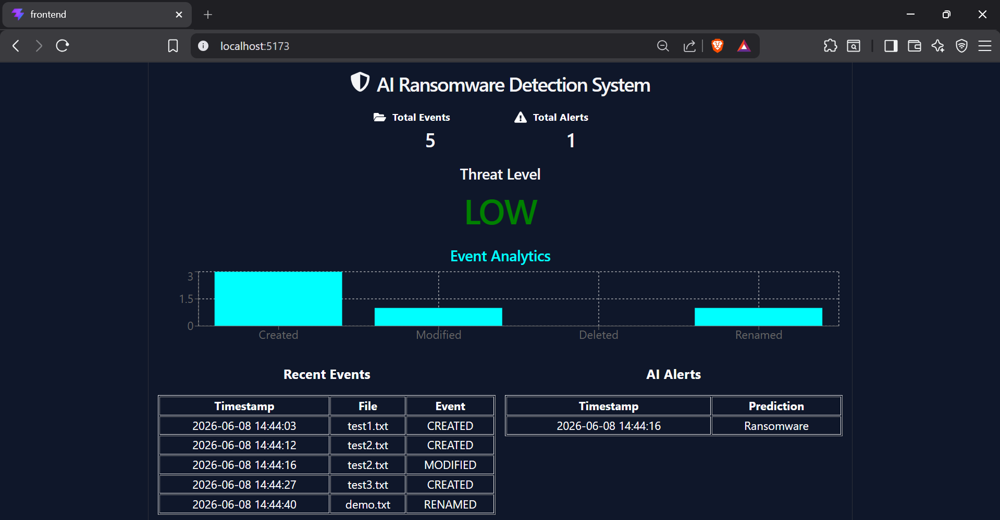
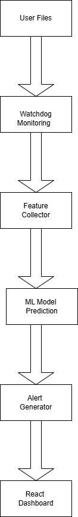
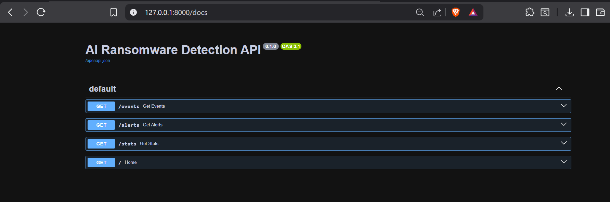

# 🛡️ AI-Based Ransomware Detection System

## 📌 Overview

AI-Based Ransomware Detection System is a cybersecurity solution that monitors file activities in real time and uses Machine Learning to detect suspicious ransomware-like behavior.

The system generates alerts and visualizes security events through an interactive React dashboard.

---

## 🚀 Features

- Real-Time File Monitoring
- AI-Based Threat Detection
- Machine Learning Prediction
- FastAPI Backend
- React Dashboard
- Event Analytics
- Threat Level Monitoring
- Security Alerts
- CSV-Based Data Storage

---

## 🏗️ System Architecture

User Activity
↓
File Monitor (Watchdog)
↓
Feature Collector
↓
Machine Learning Model
↓
Threat Detection
↓
Alert Generation
↓
React Dashboard

---

## 📸 Screenshots

### Dashboard

### Architecture

### Swagger API

---

## 🛠️ Technologies Used

### Backend

- Python
- FastAPI
- Pandas
- Scikit-Learn
- Watchdog

### Frontend

- React
- Vite
- Axios
- Framer Motion
- Recharts

---

## 📂 Project Structure

AI-Ransomware-Detection-System
│
├── backend
├── frontend
├── documentation
└── README.md

---

## 🔮 Future Enhancements

- Database Integration
- Email Alerts
- SMS Notifications
- User Authentication
- Advanced ML Models
- Cloud Deployment

---

## 👨‍💻 Author

Anuj Bendre

Computer Engineering Student
Cybersecurity Enthusiast
Python Full Stack Developer